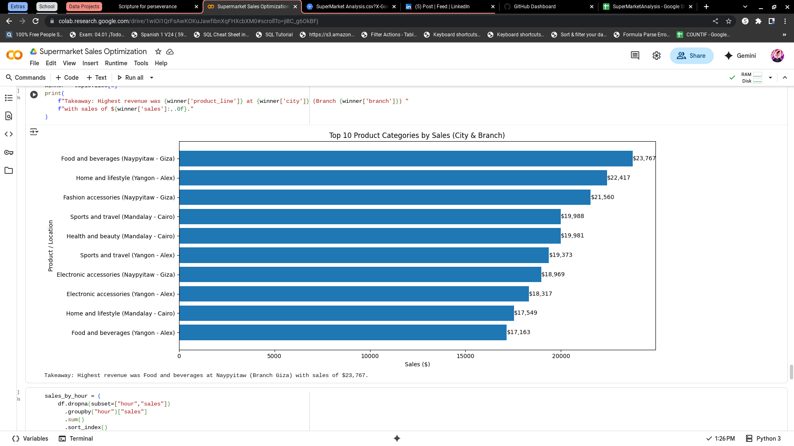
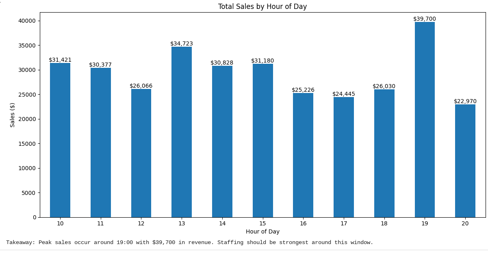
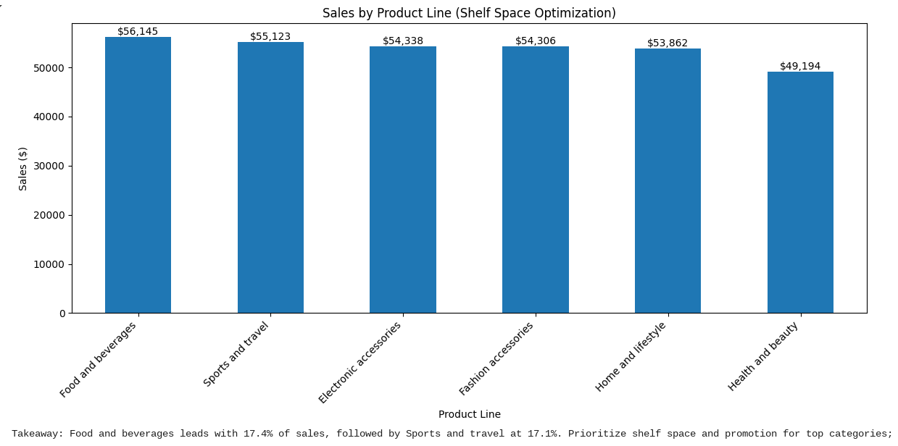

# 🛒 Supermarket Sales Optimization

This project analyzes a supermarket sales dataset to identify revenue drivers, peak shopping hours, and opportunities for staffing and shelf-space optimization.

---

## 🎯 Stakeholder Questions
- What are the **top-selling products per region and store**?
- What **times of day** see the most sales?
- Where is there opportunity to optimize **staffing or shelf space**?

---

## 🗂️ Dataset
**File**: `SuperMarketAnalysis.csv`  
**Columns**: Invoice, Branch, City, Customer Type, Gender, Product Line, Unit Price, Quantity, Tax, Sales, Date, Time, Payment, COGS, Gross Margin %, Gross Income, Rating.

---

## 🛠️ Process
- Standardized column names
- Cleaned missing values & duplicates
- Converted `date` and `time` into usable datetime features (`hour`)
- Ensured a consistent `sales` column for revenue analysis
- Aggregated with `groupby` to answer stakeholder questions
- Visualized results with Matplotlib (including value labels for clarity)

---

## 📊 Key Insights
1. **Top Products**: *Food & Beverages* in **Naypyitaw (Branch Giza)** generated **$23,767** in revenue.  
2. **Peak Hours**: Sales peaked at **19:00 (7 PM)** with **$39,700** in revenue.  
3. **Shelf Space**: *Food & Beverages* contributed **17.4% ($56,145)** of total sales, followed by *Sports & Travel* at **17.1% ($55,123)**.  

---

## 📈 Visuals
  
  
  

---

## 🧰 Tools & Skills
- **Python** (Pandas, Matplotlib, NumPy)  
- **Data Cleaning** (handling nulls, duplicates, formatting)  
- **Time Series Analysis** (sales by hour)  
- **Business Communication** (clear, stakeholder-friendly insights)  

---

## 🚀 Next Steps
- Build a **dashboard version** in Power BI or Tableau
- Add **forecasting** for sales by time of day
- Explore **customer segmentation** for targeted promotions

---

## 🏁 Conclusion
This project strengthened my skills in:
- Cleaning and preparing retail datasets
- Extracting actionable insights
- Communicating technical results in business terms

